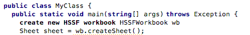
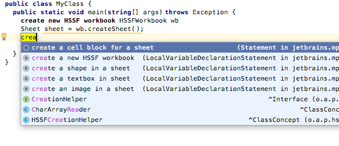
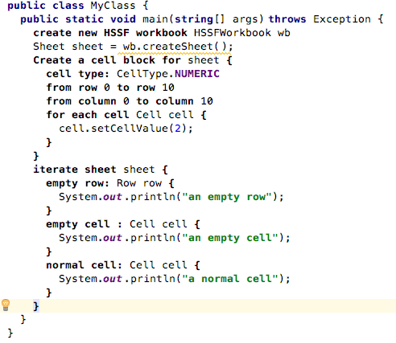
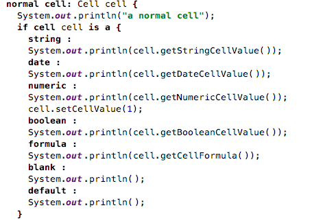
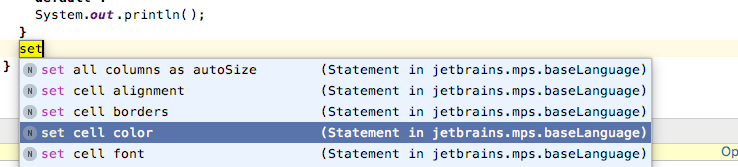
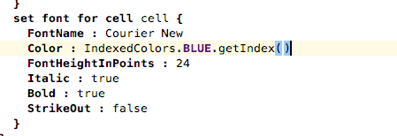
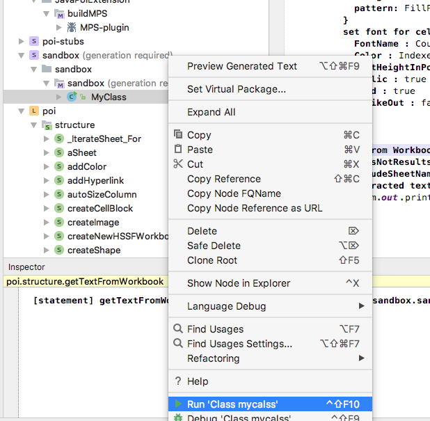
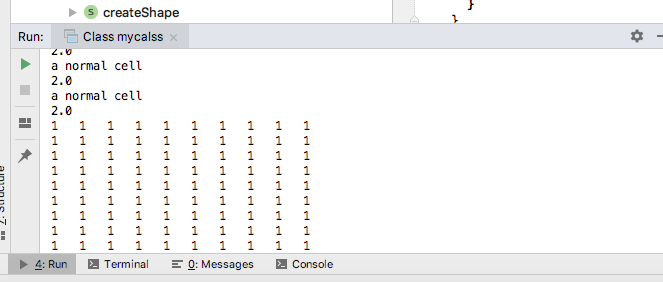
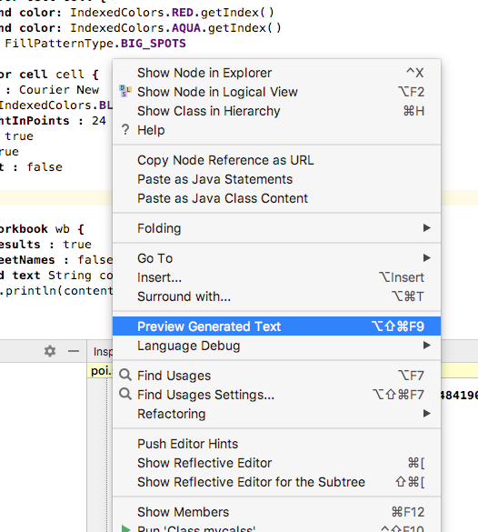

#MPS插件JavaPoiExtention使用教程
##目录
1. 在MPS中安装JavaPoiExtention插件
2. 在新项目中使用JavaPoiExtention插件
3. 利用JavaPoiExtention插件写代码

##在MPS中安装JavaPoiExtention插件
###for mac os
1. 打开MPS
2. 点击左上角的`MPS`——>`Preference`
3. 在打开的窗口中选中`Plugins`
4. 点击右下角的`Install plugin from disk`
5. 在打开的窗口中选中`JavaPoiExtention.zip`文件
6. 点击`Restart Jetbrains MPS`，自动重启后插件就可以用了

###for windows

1. 打开MPS
2. 点击左上角的`File`——>`Settings`
3. 在打开的窗口中选中`Plugins`
4. 点击右上角的齿轮图标，选取弹出菜单的`Install Plugin from Disk`
5. 在打开的窗口中选中`JavaPoiExtention.zip`文件
6. 之后会显示新增的插件，选中它，点击`Restart IDE`，自动重启后插件就可以用了

##在新项目中使用JavaPoiExtention插件
###for mac os
1. 打开MPS

2. 点击`Create New Project`

3. 左边选中`Solution Project`，右边填写`Project Name`以及`Solution Name`，点击`OK`

4. 在solution中新建一个model

    

5. 填写model的名字

    

6. 在弹出的窗口中设置model的`dependencies`和`used languwages`,具体如下

7. 设置依赖`java:org.apache.poi.ss.usermodel`

    

8. 设置依赖`java:org.apache.poi.hssf.usermodel`

    

9. 添加语言`POI`

    

10. 添加语言`jetbrains.mps.baselanguage`

    

11. 至此，所有的依赖都设置完毕，可以开始写代码了

###for Windows

操作和mac os完全一样

##利用JavaPoiExtention插件写代码

###功能目录

1. `CreateNewHSSFWorkbook`

    创建一个新的`HSSFWorkbook`，最后关闭它
    
2. `ReadWorkbook`

    从文件中读出一个`Workbook`，最后关闭它
    
3. `CreateCellBlock`

    在一个`Sheet`中创建一个方形`Cell`块
    
4. `IterateWorkbook`

    遍历一个`Workbook`，只遍历非空的`Cell`
    
5. `IterateSheet`

    遍历一个`Sheet`，可以对空行和空单元格作出处理
    
6. `SwitchCell`

    根据`Cell`的类型作出不同处理
    
7. `setCellColoe`

    设置单元格颜色
    
8. `setCellFont`

    设置单元格字体
    
9. `GetCellContent`

    以`String`的姓氏获得单元格的内容
    
10. `GetTextFromWorkbook`

    获得`Workbook`的所有内容，以`String`的形式
    

###一些快捷键
先是几个重要的MPS快捷键，它们可以在`MPS`-->`Preference`-->`keymap`中调整

1. `complete smart`：补全键，作者使用`alt`+`space`
2. `intentions`：列出可选的功能，这个不能改键位，mac上是`alt`+`enter`
3. `Expand Selection`：AST中扩大选中范围，作者使用`command`+`up`
4. `Shrink Selection`：AST中缩小选中范围，作者使用`command`+`down`
5. `Select Previous`：扩大选中范围，选中上一行，作者使用`shift`+`up`
6. `Select Next` ：扩大选中范围，选中下一行，作者使用`shift`+`down`
7. `copy & paste`：复制粘贴，作者使用`ctrl`+`c`，`ctrl`+`v`

###一个例子

###for mac os

这里用一个例子展示如何用JavaPoiExtention写代码

1. 在model中创建一个java class

    

2. 填写好类名与main函数（psvm）之后，输入`crea`，敲击快捷键`ctrl`+`space`,选中`CreateNewHSSFWorkbook`，创建一个新的工作簿

    

3. 填充空缺的单元，方法类似前一步骤（利用快捷键`ctrl`+`space`）

    

4. 在中间的空语句块中写代码，先创建一个`Sheet`

    

5. 在刚创建的`sheet`中填充一些单元格

    

6. 单元格范围是(0,0)到(10，10)，

    

7. 单元类型是`CellType.NUMERIC`，对每个单元设置它的值为2

    

8. 遍历一个表格，包括空行和空单元

    

9. 在对应部分填充处理语句

    

10. 对每个非空单元作出处理，根据单元格类型进行不同处理

    

11. 打印单元格内容，如果是`NUMERIC`类型，将其值设置为1

    

12. 设置单元格字体颜色

    

13. 前景水色背景红色，填充方式为`BIG_SPOTS`

    

14. 设置单元格字体

    

15. 字体名字为`Courier New`，大小为24磅，斜体加粗，没有删除线

    

16. 将`Workbook`中的所有内容取出

    

17. 公式不包括在结果中，也不包括`Sheet`的名字，将`Workbook`的内容`content`打印出来

    

18. 运行该类的main函数

    

19. 部分输出结果如图，程序正常结束

    

20. 在编辑器中点击右键，查看生成的java代码

    

21. 产生的java代码（部分）如图所示

    
    
###for windows

与mac os版一样
    
###设置工作目录的方法：

1. 打开`Run`菜单，选取`Edit Configurations`

    
    
2. 编辑对应类的`Working directory`

    
     

##This Complete the Tutorial